# AdguardHome Installation Guide

**1.1** Download and install AdguardHome:

```sh
wget --no-check https://github.com/AdguardTeam/AdGuardHome/releases/download/v0.103.3/AdGuardHome_linux_arm64.tar.gz -O AdGuardHome_linux_arm64.tar.gz
tar -zxvf AdGuardHome_linux_arm64.tar.gz
cd AdGuardHome
chmod a+x AdGuardHome
./AdGuardHome -s install
systemctl start AdGuardHome
systemctl enable AdGuardHome
```

**1.2** Install LUCI Companion APP (TODO / TO TEST)
```sh
wget --no-check https://github.com/rufengsuixing/luci-app-adguardhome/releases/download/1.8-11/luci-app-adguardhome_1.8-11_all.ipk -O luci-app-adguardhome_1.8-11_all.ipk
opkg install luci-app-adguardhome_1.8-11_all.ipk
```
``` /etc/config/AdGuardHome 

config AdGuardHome 'AdGuardHome'
	option httpport '3000'
	option configpath '/root/AdGuardHome/AdGuardHome.yaml'
	option workdir '/root/AdGuardHome'
	option logfile '/tmp/AdGuardHome.log'
	option verbose '0'
	option binpath '/root/AdGuardHome/AdGuardHome'
	option hostsmd5 '5504bb04bd01cb0e340aee9e2ae065b2'
	option version 'core error'
	option binmtime '1595611966'
	option waitonboot '1'
	option ucitracktest '1'
	option enabled '1'
	option upprotect '$binpath $configpath $workdir/data/filters'
	option backupfile 'filters'
	option backupwdpath '/root/AdGuardHome'
	option redirect 'dnsmasq-upstream'
	list old_redirect 'dnsmasq-upstream'
	list old_port '1745'
	list old_enabled '1'
```

**2.** Open a browser and enter the URL http://192.168.8.1:3000/ to access the AdGuard Home administration page.

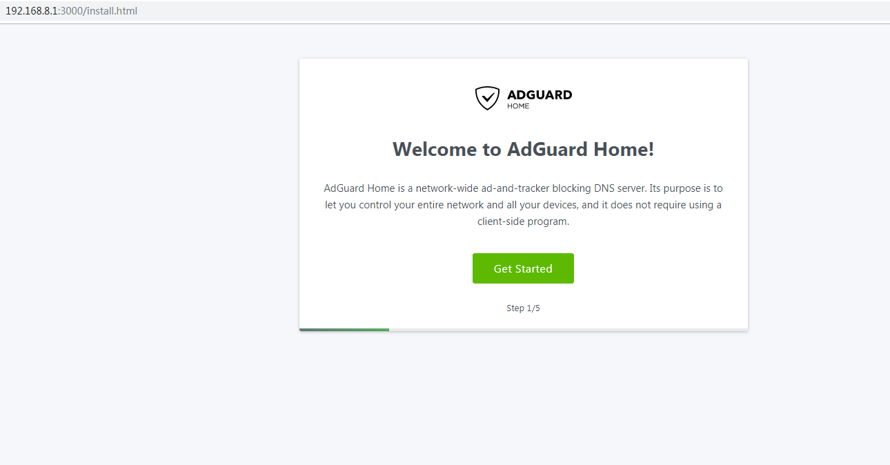

**3.** Click "Get Started" and set the web administration page and DNS service port.

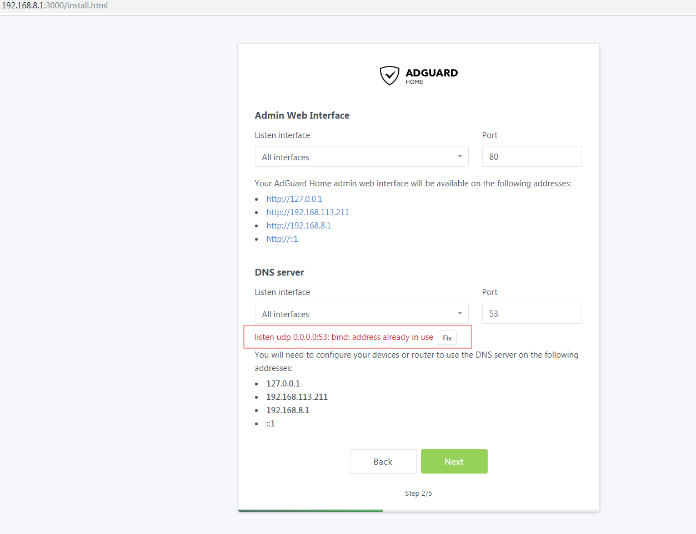

**4.** When the red prompt appears, you need to turn off the dnsmasq service that comes with the ubuntu system:

```sh
/etc/init.d/dnsmasq stop
systemctl disable dnsmasq.service
```

**5.** Click on "Fix" and proceed to the next step to set up your username and password.

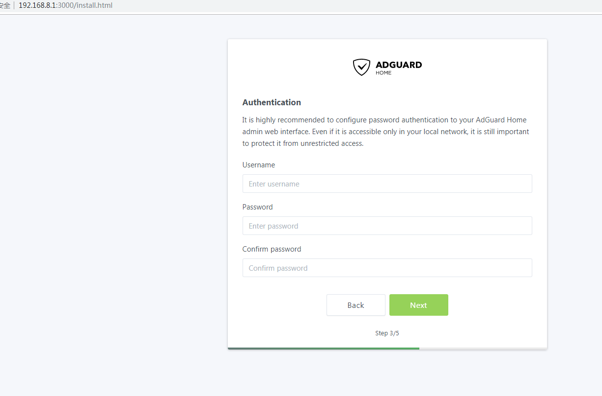

**6.** Finally click "Next" to complete the configuration.

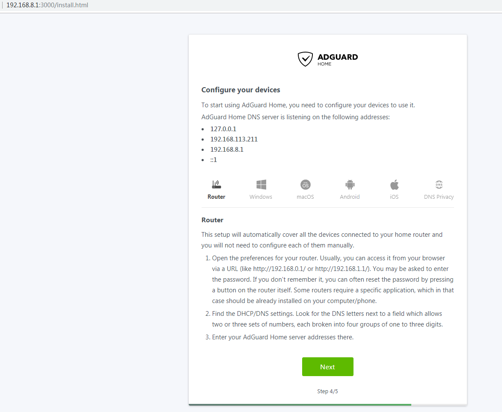

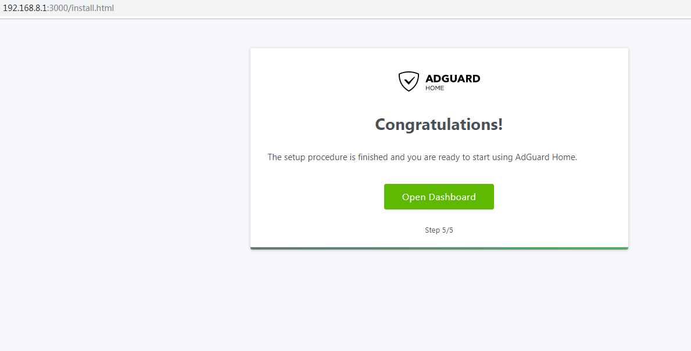

**7.** Login again to access the dashboard. You can see the number of DNS queries, the website that was filtered and intercepted, the client address for querying DNS requests etc.

**8.** Continue by setting the DNS and DHCP options.

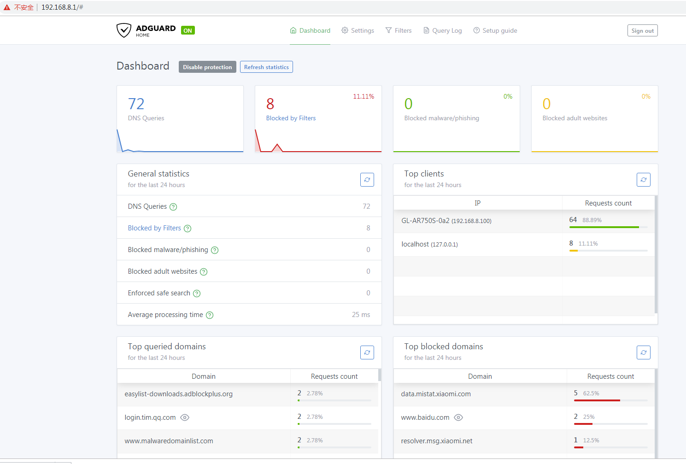

General settings

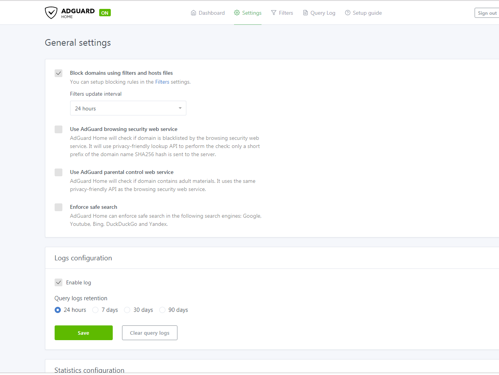

DNS settings

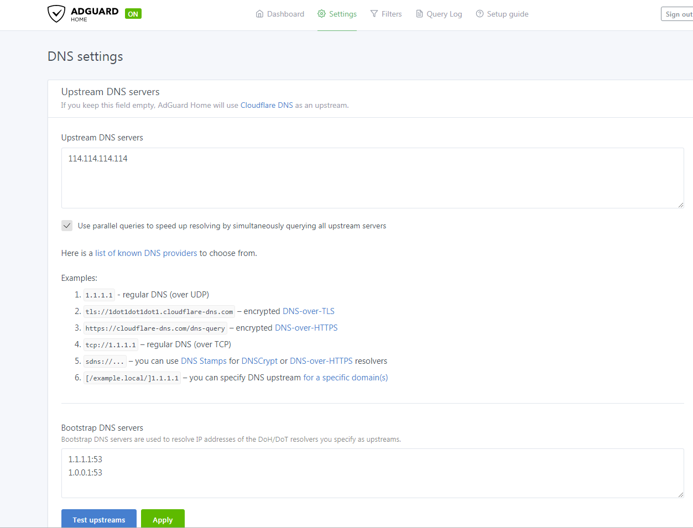

If your router has DNS problems that cannot be resolved, you will need run the following:

```sh
cd /etc
rm resolv.conf
ln -s ../run/systemd/resolve/resolv.conf resolv.conf
```

If a client connects to the MV1000 and cannot obtain an ip address, you need to configure DHCP in the DHCP settings page:

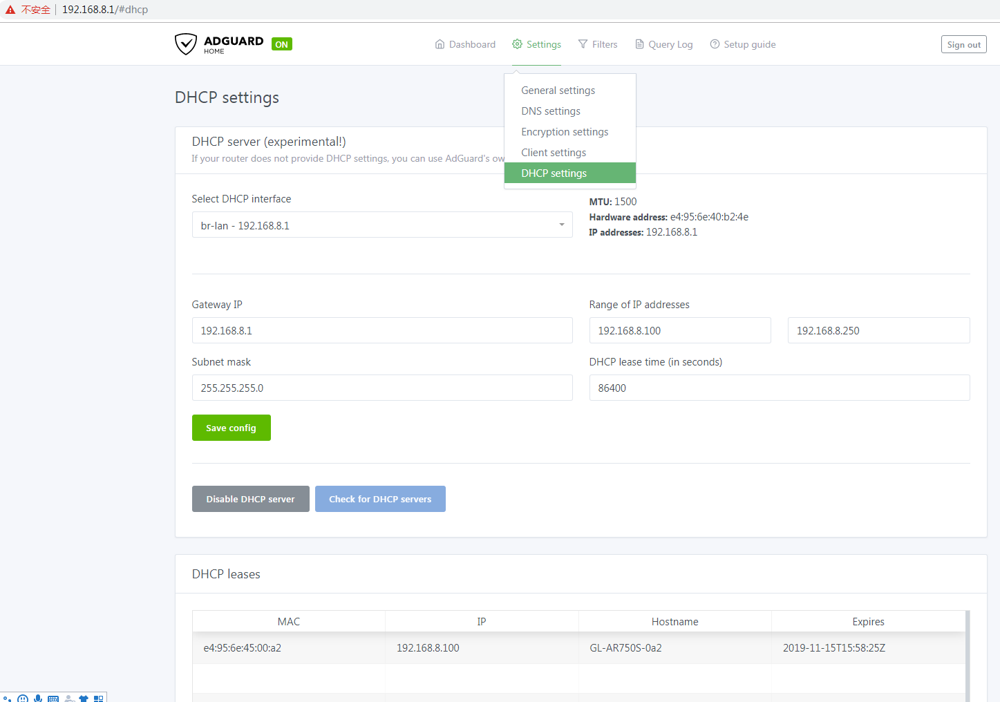

Filters

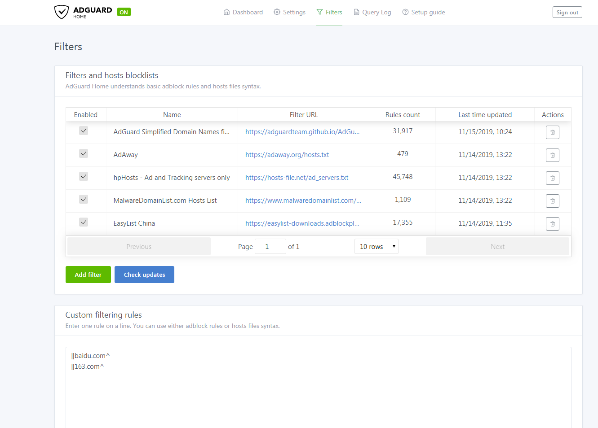

Query Log

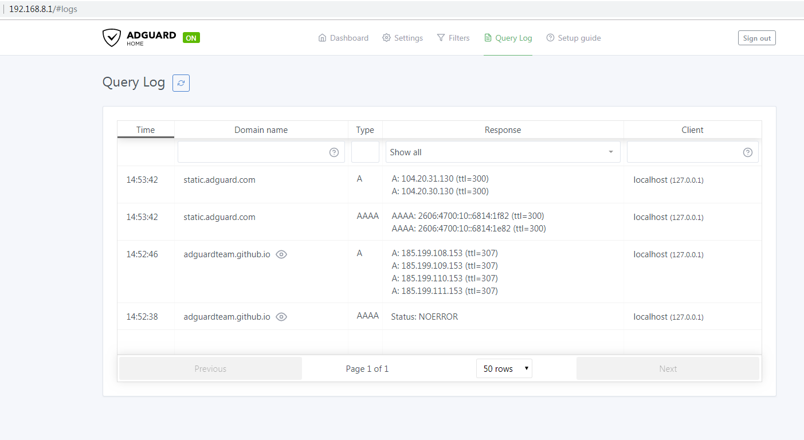

**8.** Add Adult Porn filter list.

https://github.com/alexsannikov/adguardhome-filters
https://raw.githubusercontent.com/alexsannikov/adguardhome-filters/master/porn.txt

https://forum.openwrt.org/t/howto-running-adguard-home-on-openwrt/51678

```/etc/config/dhcp

config dnsmasq
	option localise_queries '1'
	option rebind_protection '1'
	option rebind_localhost '1'
	option expandhosts '1'
	option readethers '1'
	option nonwildcard '0'
...
	list rebind_domain 'onion'
	option allservers '1'
	option nonegcache '1'
	option filterwin2k '1'
	option confdir '/tmp/dnsmasq.d'
	option noresolv '1'
	option port '53'
#	list server '127.0.0.1#1745'
	list server '10.4.2.1#1745'
....
	list server '/onion/127.0.0.1#9053'
	list server '8.8.4.4'

```
