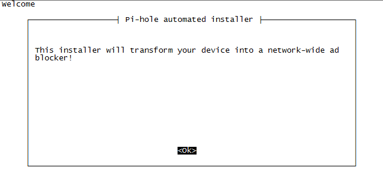
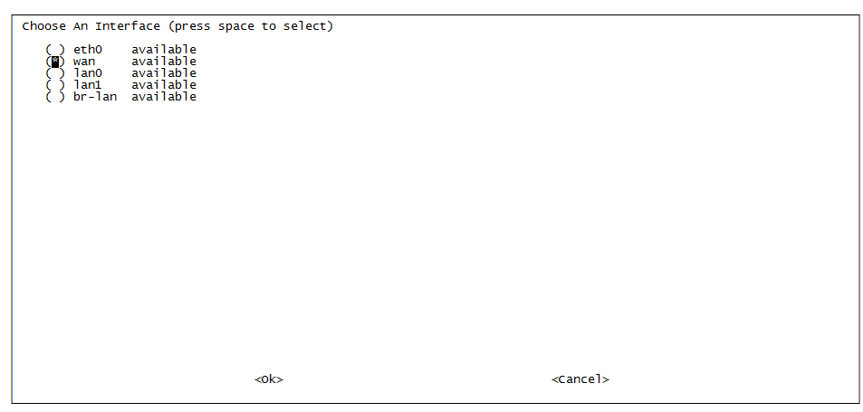
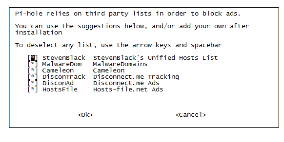
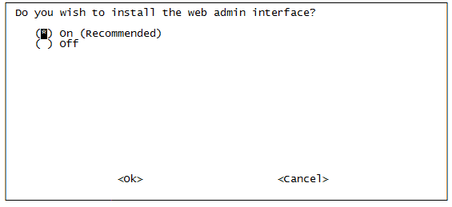
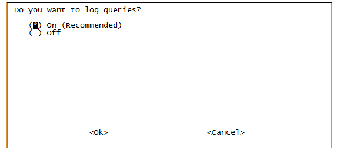
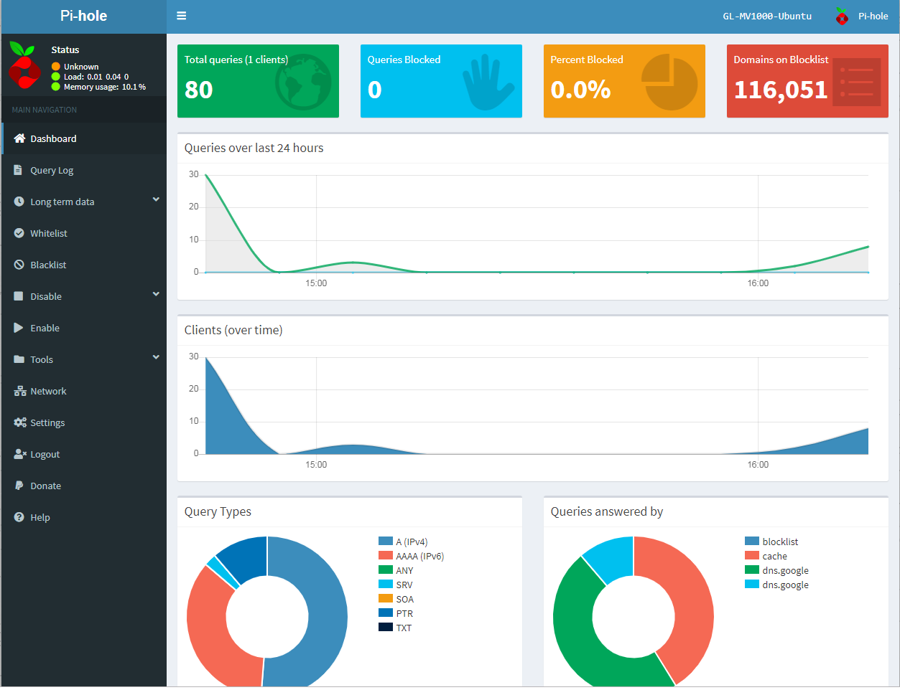
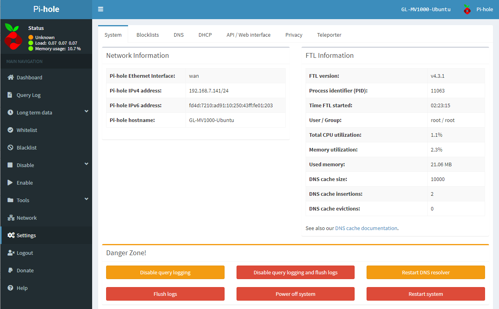

# MV1000 install Pi-hole Guide

## Pi-hole

The Pi-hole[®](https://pi-hole.net/trademark-rules-and-brand-guidelines/) is a [DNS sinkhole](https://en.wikipedia.org/wiki/DNS_Sinkhole) that protects your devices from unwanted content, without installing any client-side software.

## MV1000 install Ubuntu System and Environment Preparation

1. You can refer the documentation
   <https://docs.gl-inet.com/en/3/app/ssh/>,
   connect to the router with WinSCP, copy the ubuntu system file ubuntu.tar.gz to
   the router tmp directory.

2. You need the ssh router to upgrade to the ubuntu system with the following command:
```
ubuntu_upgrade -n /tmp/ubuntu.tar.gz 
switch_system ubuntu
```
3. Install software soft package
```
sudo apt-get install git
```

4. Disable dnsmasq dns server to solve conflict with pi-hole installation
```
cp /etc/dnsmasq.conf /etc/dnsmasq.conf.bak1
echo "port=0" >>/etc/dnsmasq.conf
systemctl restart dnsmasq
```

## Download Pi-hole Source and Installation Script

1. Download pi-hole source and install
```
git clone --depth 1 https://github.com/pi-hole/pi-hole.git pi-hole
cd pi-hole/automated\ install/
sudo bash basic-install.sh
```















## Login Web Page

After the installation completed, enter http://192.168.8.1/admin or <http://192.168.7.141/admin (192.168.8.1 is the router LAN IP, 192.168.7.141 is the router WAN port IP) in the browser to open the login interface.


SSH to the router to modify the login password with the command


Then you can log in to the pi-hole management page.



On the page you can view the network information, you can configure the black and white list and dns, etc.




The background Pi-Hole configuration command can view the official documentation. <https://discourse.pi-hole.net/t/the-pihole-command-with-examples/738>

More configuration information to view <https://docs.pi-hole.net/main/projects/>

